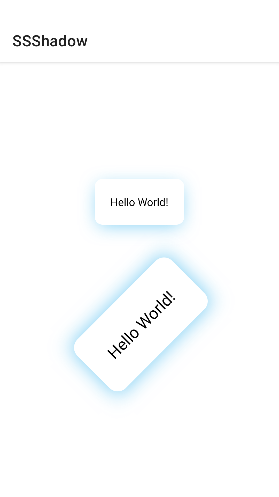
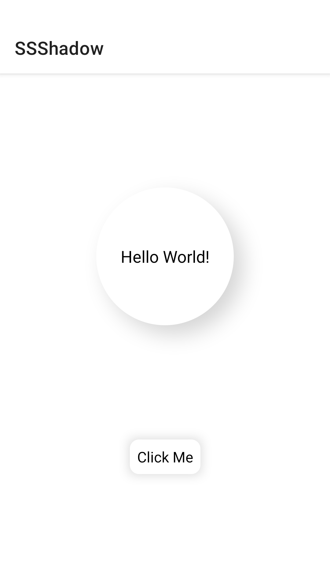
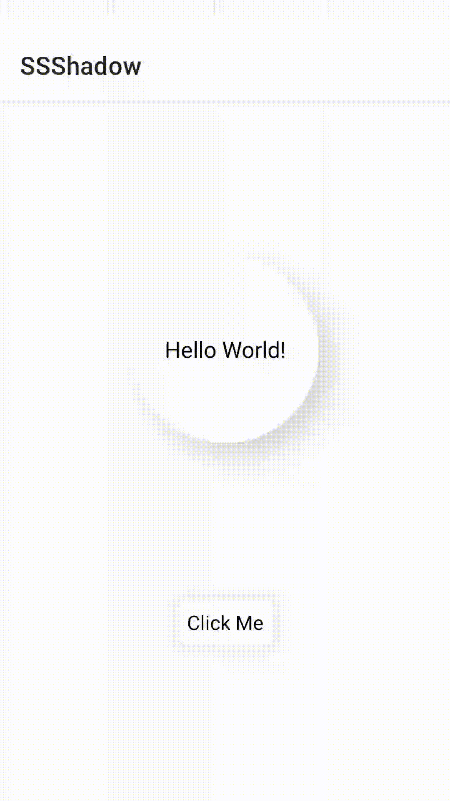
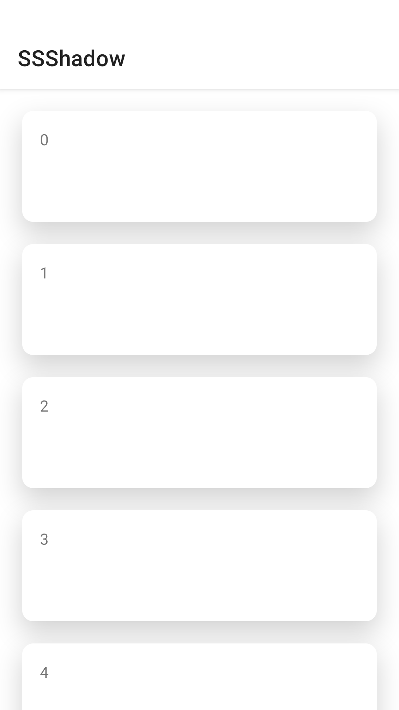
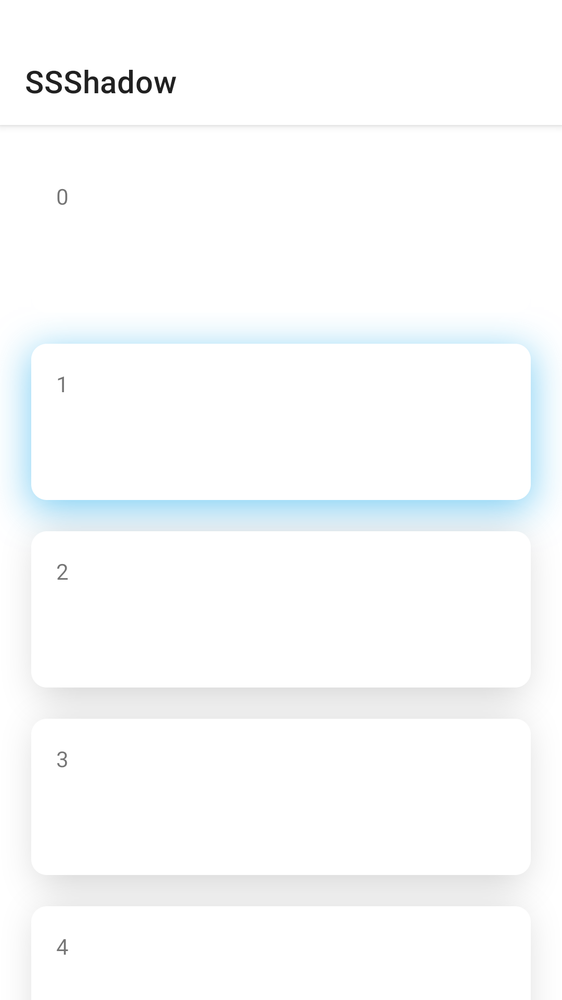
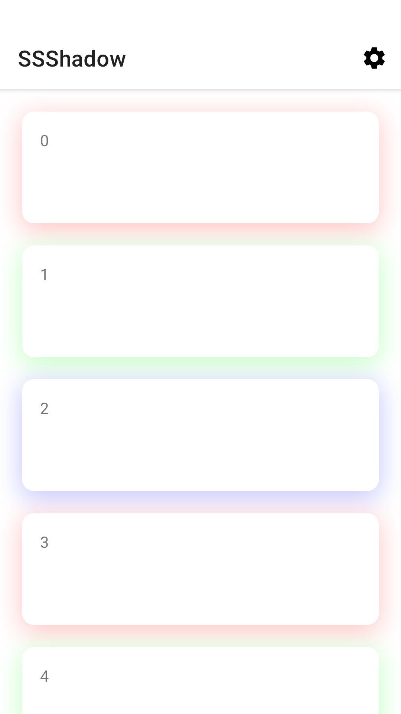
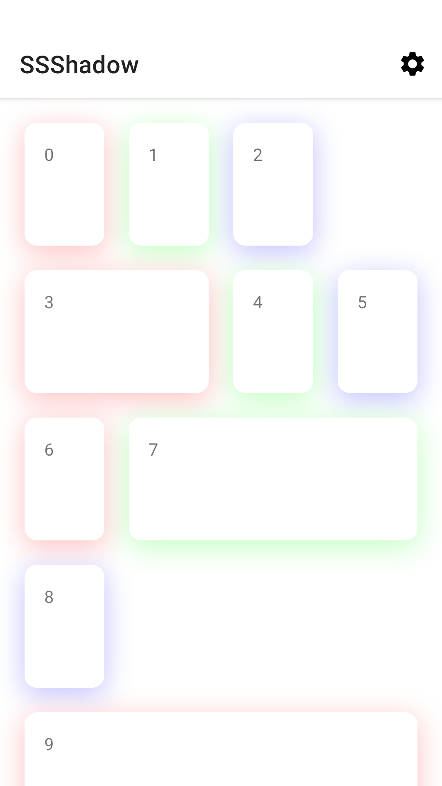
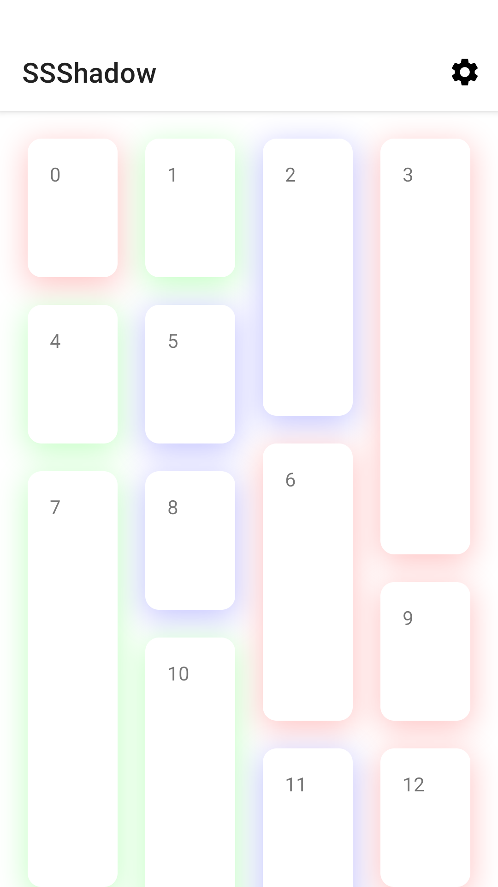
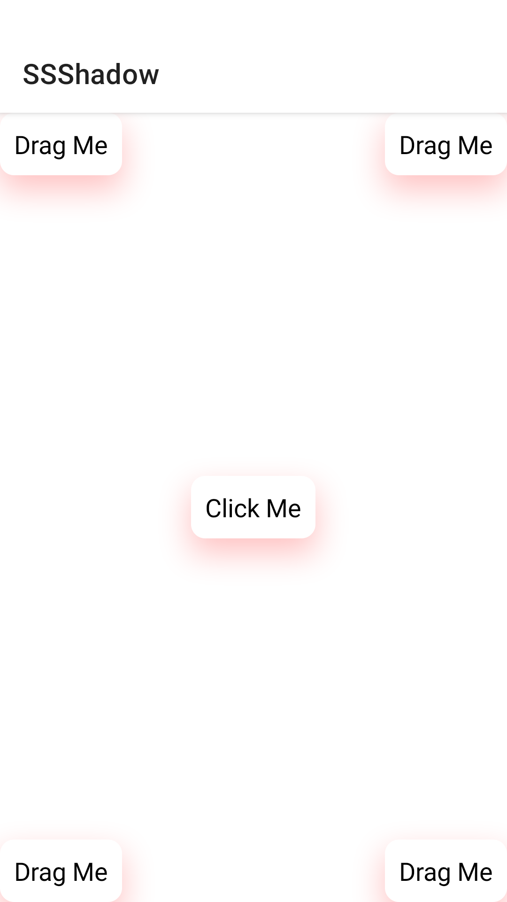
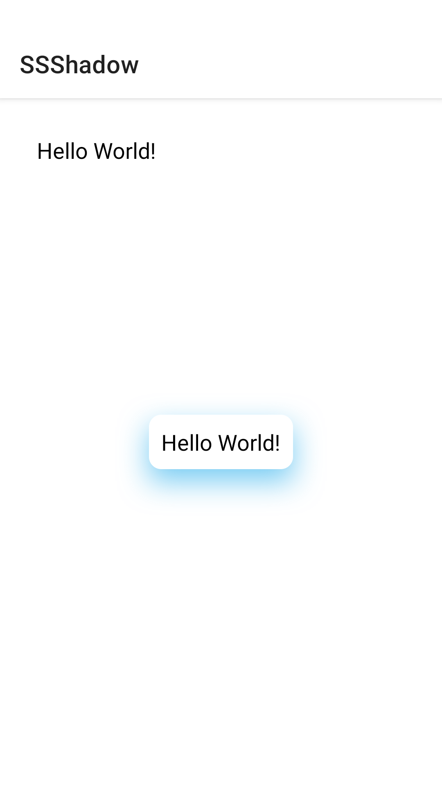

# 🌤SSShadow: Android 阴影库🌥<br>👻不占位🧚、💃支持动画🕺

[](https://jitpack.io/#EnnisWu/SSShadow)

1. ShadowLayer 支持 ConstraintLayout🦄
2. ShadowDecoration 支持 RecyclerView🐳
3. ShadowWrapperLayout 支持所有布局（备选方案，优先使用 ShadowLayer）🐡

## Installation

Step 1. Add the JitPack repository to your build file

Add it in your root `build.gradle` at the end of repositories:

```groovy
	allprojects {
		repositories {
			maven { url 'https://jitpack.io' }
		}
	}
```

Step 2. Add the dependency

```groovy
	dependencies {
	        implementation 'com.github.EnnisWu:SSShadow:0.0.1'
	}
```

## Quick Start

### 使用 ShadowLayer

```xml
<?xml version="1.0" encoding="utf-8"?>
<!-- 效果如图 1-1 -->
<androidx.constraintlayout.widget.ConstraintLayout 
    xmlns:android="http://schemas.android.com/apk/res/android"
    xmlns:app="http://schemas.android.com/apk/res-auto"
    xmlns:tools="http://schemas.android.com/tools"
    android:layout_width="match_parent"
    android:layout_height="match_parent">

    <com.enniswu.ssshadow.widget.ShadowLayer
        android:layout_width="wrap_content"
        android:layout_height="wrap_content"
        app:constraint_referenced_ids="textView1"
        app:shadow_color="@color/color_9010a5ea"
        app:shadow_radius="20dp"
        app:shadow_offsetY="5dp"
        app:shadow_shape="rectangle"
        app:shadow_extension="-5dp"
        tools:ignore="MissingConstraints"/>

    <com.enniswu.ssshadow.widget.ShadowLayer
        android:layout_width="wrap_content"
        android:layout_height="wrap_content"
        app:constraint_referenced_ids="textView2"
        app:shadow_color="@color/color_9010a5ea"
        app:shadow_radius="20dp"
        app:shadow_shape="rectangle"
        tools:ignore="MissingConstraints"/>

    <TextView
        android:id="@+id/textView1"
        android:layout_width="wrap_content"
        android:layout_height="wrap_content"
        android:background="@drawable/shape_rectangle_white"
        android:padding="20dp"
        android:text="@string/hello_world"
        android:textColor="@android:color/black"
        app:layout_constraintVertical_bias="0.3"
        app:layout_constraintBottom_toBottomOf="parent"
        app:layout_constraintEnd_toEndOf="parent"
        app:layout_constraintStart_toStartOf="parent"
        app:layout_constraintTop_toTopOf="parent" />

    <TextView
        android:id="@+id/textView2"
        android:layout_width="wrap_content"
        android:layout_height="wrap_content"
        android:background="@drawable/shape_rectangle_white"
        android:padding="20dp"
        android:text="@string/hello_world"
        android:textColor="@android:color/black"
        android:scaleX="1.5"
        android:scaleY="1.5"
        android:translationX="20dp"
        android:translationY="20dp"
        android:rotation="315"
        android:transformPivotX="0dp"
        android:transformPivotY="50dp"
        app:layout_constraintVertical_bias="0.7"
        app:layout_constraintBottom_toBottomOf="parent"
        app:layout_constraintEnd_toEndOf="parent"
        app:layout_constraintStart_toStartOf="parent"
        app:layout_constraintTop_toTopOf="parent" />

</androidx.constraintlayout.widget.ConstraintLayout>
```

| 图 1-1 | 图 1-2 | 图 1-3 |
| -- | -- | -- |
|  |  |  |

### 使用 ShadowDecoration

- 所有项显示相同的阴影❤️❤️❤️

通过构造方法或 `setShadow` 方法, `setExtension` 方法传入参数

```kotlin
//效果如图 2-1
binding.recyclerView.layoutManager = LinearLayoutManager(this)
binding.recyclerView.adapter = Adapter()
binding.recyclerView.addItemDecoration(LinearBoundDecoration(dp20, dp20, dp20, dp20, dp20))
val shadowDecoration = ShadowDecoration(resources.getColor(R.color.black_2f), dp20, 0, dp10,
        0, 0, 0, 0, Shape.RECT, 0)
shadowDecoration.attachToRecyclerView(lifecycle, binding.recyclerView)
```

- 根据位置显示不同的阴影或不显示💚💙💜

通过给 ShadowDecoration 设置 ItemShadow 实现

```kotlin
//效果如图 2-2
override fun onCreate(savedInstanceState: Bundle?) {
    super.onCreate(savedInstanceState)
    val binding = LayoutRecyclerViewBinding.inflate(layoutInflater)
    setContentView(binding.root)

    binding.recyclerView.layoutManager = LinearLayoutManager(this)
    binding.recyclerView.adapter = Adapter()
    binding.recyclerView.addItemDecoration(LinearBoundDecoration(dp20, dp20, dp20, dp20, dp20))
    val shadowDecoration = ShadowDecoration(this)
    shadowDecoration.attachToRecyclerView(lifecycle, binding.recyclerView)
}

override fun getItemShadow(position: Int, parameter: ShadowParameter): Boolean {
    if (position == 0) {
        return false
    }
    if (position == 1) {
        parameter.setShadow(resources.getColor(R.color.color_9010a5ea), dp20, 0, dp5, Shape.RECT)
        return true
    }
    parameter.setShadow(resources.getColor(R.color.black_2f), dp20, 0, dp5, Shape.RECT)
    parameter.setExtension(-dp5, 0, -dp5, 0)
    return true
}
```

| 图 2-1 | 图 2-2 | 图 2-3 |
| -- | -- | -- |
|  |  |  |

| 图 2-4 线性 | 图 2-5 网格 | 图 2-6 瀑布流 |
| -- | -- | -- |
|  |  |  |

### 使用 ShadowWrapperLayout

需要绘制阴影的子 View 需要通过 `shadow_referencedIds` 属性指定 id，在 Java/Kotlin 中可以通过 `addNeedShadowView` 方法添加，`removeNeedShadowView` 方法移除。

- 所有需要绘制阴影的子 View 显示相同的阴影❤️❤️❤️

```xml
<?xml version="1.0" encoding="utf-8"?>
<com.enniswu.ssshadow.widget.ShadowWrapperLayout 
    xmlns:android="http://schemas.android.com/apk/res/android"
    xmlns:app="http://schemas.android.com/apk/res-auto"
    android:layout_width="match_parent"
    android:layout_height="match_parent"
    app:shadow_referencedIds="tv1,tv2"
    app:shadow_color="@color/red_3f"
    app:shadow_radius="20dp">

    <FrameLayout
        android:layout_width="match_parent"
        android:layout_height="match_parent">

        <LinearLayout
            android:layout_width="wrap_content"
            android:layout_height="wrap_content"
            android:layout_margin="20dp">

            <TextView
                android:id="@+id/tv1"
                android:layout_width="wrap_content"
                android:layout_height="wrap_content"
                android:background="@drawable/shape_rectangle_white"
                android:padding="10dp"
                android:textColor="@android:color/black"
                android:textSize="18sp"
                android:text="@string/hello_world" />

        </LinearLayout>

        <TextView
            android:id="@+id/tv2"
            android:layout_width="wrap_content"
            android:layout_height="wrap_content"
            android:layout_gravity="center"
            android:background="@drawable/shape_rectangle_white"
            android:padding="10dp"
            android:textColor="@android:color/black"
            android:textSize="18sp"
            android:text="@string/hello_world" />

    </FrameLayout>

</com.enniswu.ssshadow.widget.ShadowWrapperLayout>
```

- 所有需要绘制阴影的子 View 显示不同的阴影或不显示💚💙💜

通过给 ShadowWrapperLayout 设置 ChildShadow 实现

```xml
<?xml version="1.0" encoding="utf-8"?>
<com.enniswu.ssshadow.widget.ShadowWrapperLayout 
    xmlns:android="http://schemas.android.com/apk/res/android"
    xmlns:app="http://schemas.android.com/apk/res-auto"
    android:layout_width="match_parent"
    android:layout_height="match_parent"
    app:shadow_referencedIds="tv1,tv2">

    <FrameLayout
        android:layout_width="match_parent"
        android:layout_height="match_parent">

        <LinearLayout
            android:layout_width="wrap_content"
            android:layout_height="wrap_content"
            android:layout_margin="20dp">

            <TextView
                android:id="@+id/tv1"
                android:layout_width="wrap_content"
                android:layout_height="wrap_content"
                android:background="@drawable/shape_rectangle_white"
                android:padding="10dp"
                android:textColor="@android:color/black"
                android:textSize="18sp"
                android:text="@string/hello_world" />

        </LinearLayout>

        <TextView
            android:id="@+id/tv2"
            android:layout_width="wrap_content"
            android:layout_height="wrap_content"
            android:layout_gravity="center"
            android:background="@drawable/shape_rectangle_white"
            android:padding="10dp"
            android:textColor="@android:color/black"
            android:textSize="18sp"
            android:text="@string/hello_world" />

    </FrameLayout>

</com.enniswu.ssshadow.widget.ShadowWrapperLayout>
```

```kotlin
//效果如图 3-2
override fun onCreate(savedInstanceState: Bundle?) {
    super.onCreate(savedInstanceState)
    val binding = ActivitySimpleWrapperLayout2Binding.inflate(layoutInflater)
    setContentView(binding.root)

    binding.root.childShadow = this
}

override fun getChildShadow(child: View, parameter: ShadowParameter): Boolean {
    if (child.id == R.id.tv1) {
        return false
    }
    parameter.setShadow(resources.getColor(R.color.color_9010a5ea), dp20, 0, dp10, Shape.RECT)
    return true
}
```

| 图 2-1 | 图 2-2 | 图 2-3 |
| -- | -- | -- |
|  |  |  |

**详细使用查看 Demo。**

## ShadowLayer ShadowWrapperLayout XML 属性说明

### 共同的属性

| 属性名 | 取值 | 说明 |
| -- | -- | -- |
| shadow_color | color | 阴影颜色（必须有透明度） |
| shadow_radius | dimension | 模糊半径（不是圆角的半径） |
| shadow_offsetX | dimension | X 轴偏移量，正数右偏移，负数左偏移 |
| shadow_offsetY | dimension | Y 轴偏移量，正数下偏移，负数上偏移 |
| shadow_extension | dimension | 扩展（同时设置 4 个方向，可以设置负数） |
| shadow_extensionHorizontal | dimension | 水平扩展（同时设置左右方向，可以设置负数）|
| shadow_extensionVertical | dimension | 垂直扩展（同时设置上下方向，可以设置负数）|
| shadow_extensionLeft | dimension | 左扩展，可以设置负数 |
| shadow_extensionTop | dimension | 上扩展，可以设置负数 |
| shadow_extensionRight | dimension | 右扩展，可以设置负数 |
| shadow_extensionBottom | dimension | 下扩展，可以设置负数 |
| shadow_shape | rectangle / oval / roundRectangle | 形状（矩形、圆形或圆角矩形） |
| shadow_rectRadius | dimension | 圆角半径（仅在形状为圆角矩形时有效） |
| shadow_lightSourceRotation | boolean | View 旋转时阴影的光源是否跟着旋转，默认 false |

### ShadowWrapperLayout 特有的属性

| 属性名 | 取值 | 说明 |
| -- | -- | -- |
| shadow_referencedIds | string | 需要绘制阴影的 View 的 id，逗号分隔 |

**需要绘制阴影的 View 必须有一个 id 并添加到 `shadow_referencedIds` 属性中**，逗号分隔，如果要动态添加或移除需要调用 `addNeedShadowView` 方法或 `removeNeedShadowView`。

## Java 方法

- 设置阴影参数和扩展：

```java
void setShadow(int color, int radius, int offsetX, int offsetY, @Shape int shape)

void setShadow(int color, int radius, int offsetX, int offsetY, @Shape int shape, int rectRadius)

void setExtension(int extensionLeft, int extensionTop, int extensionRight, int extensionBottom)
```

ShadowLayer，ShadowDecoration，ShadowWrapperLayout，ShadowParameter 都有 `setShadow` 和 `setExtension` 方法。

- 动画：需要在目标 View 执行动画时持续调用，当目标 View 执行动画时阴影会和目标 View 保持相同的动画效果。

```java
void animation()
```

ShadowLayer，ShadowDecoration，ShadowWrapperLayout 都有 `animation` 方法。

## ShadowLayer

一个 ShadowLayer 可以绘制一块阴影，一个 ShadowLayer 只可以为一个 View 绘制阴影。

## ShadowDecoration

ShadowDecoration 可以为 RecyclerView 的子 View 绘制阴影。

**ShadowDecoration 本身只负责阴影绘制**，👉需要配合 LinearMarginDecoration, GridMarginDecoration, StaggeredGridMarginDecoration 在子 View 之间开辟间距。

1. 所有 item 默认阴影参数

ShadowDecoration 可以在 `setShadow` `setExtension` 或构造方法中设置阴影参数，这里设置的参数会应用于所有项。

2. 根据 position 使用不同的阴影参数

如果我想要根据不同的位置设置不同的阴影呢？🤔

实现 ItemShadow 接口并将它设置到 ShadowDecoration 就可以啦！😆

```java
boolean getItemShadow(int position, @NonNull ShadowParameter parameter);
```

ItemShadow 只有一个 `getItemShadow` 方法，他会传入当前绘制的位置和 ShadowParameter，通过调用你熟悉的 `setShadow` `setExtension` 方法设置该项的阴影参数并返回 `true` 即可。

如果我希望这个位置没有阴影呢？

直接返回 `false` 就可以啦！

## ShadowWrapperLayout

注意：建议布局使用 ConstraintLayout 实现并通过 ShadowLayer 实现阴影，ShadowWrapperLayout 仅作为备选方案。

ShadowWrapperLayout 使用和 ShadowDecoration 类似。

1. ShadowWrapperLayout 同样可以在 `setShadow` `setExtension` 或构造方法中设置阴影参数，这里设置的参数会应用于所有通过 `shadow_referencedIds` 设置了 id 的子 View。

2. 通过实现 ChildShadow 接口为不同的子 View 设置不同的阴影。

```java
boolean getChildShadow(@NonNull View child, @NonNull ShadowParameter parameter);
```

ChildShadow 接口和 ItemShadow 接口是类似的，不同的是第一个参数变成了待绘制阴影的子 View。

ShadowWrapperLayout 支持跨层绘制阴影，你只需要在最外层包裹一个 ShadowWrapperLayout 即可✌️。

## 动画

当目标 View 正在执行动画时需要调用 `animation` 方法保持阴影和目标 View 的同步。

### 动画支持情况

|    | ShadowLayer(不支持 MotionLayout) | ShadowDecoration | ShadowWrapperLayout |
| -- | -- | -- | -- |
| translationX | ✅ Yes | ✅ Yes | ✅ Yes |
| translationY | ✅ Yes | ✅ Yes | ✅ Yes |
| scaleX | ✅ Yes | ✅ Yes | ✅ Yes (不支持动画是目标 View 的父 View 的情况) |
| scaleY | ✅ Yes | ✅ Yes | ✅ Yes (不支持动画是目标 View 的父 View 的情况) |
| rotation | ✅ Yes | ✅ Yes | ✅ Yes (不支持动画是目标 View 的父 View 的情况) |
| rotationX | ❌ No | ❌ No | ❌ No |
| rotationY | ❌ No | ❌ No | ❌ No |
| alpha | ❌ No | ❌ No | ❌ No |

## Tips

- 目标 View 需要有一个**不透明的背景**，否则会显示出底部阴影的颜色。
- **阴影颜色需要有透明度**（透明度为 255 或 0 则不会显示）。
- ShadowLayer 阴影的叠加顺序取决于 ShadowLayer 的顺序，建议将所有 ShadowLayer 写在最上方。
- 如果 RecyclerView 使用 padding 设置间距请将 `clipToPadding` 属性设为 false。
- StaggeredGridBoundDecoration 无法计算主轴的底部间距，需要配合 padding 设置。
- 如果使用自定义 LayoutManager 需要自己实现一个 ItemDecoration 开辟间距。
- `getItemShadow` 方法和 `getChildShadow` 方法会在 `onDraw` 方法中回调，**请不要在这两个方法中创建对象**。
- ShadowLayer 通过持续调用 `requestLayout` 方法实现动画。
- ShadowDecoration 和 ShadowWrapperLayout 通过持续调用 `invalidate` 方法实现动画。
- ShadowLayer 不支持 MotionLayout 因为 ConstraintHelper 在 MotionLayout 中无法拿到引用控件的长宽。
- 新开发的布局请使用 ConstraintLayout 配合 ShadowLayer 实现阴影，ShadowWrapperLayout 的设计初衷是项目中已存在的布局在不便于用 ConstraintLayout 重写时可以使用 ShadowWrapperLayout 实现阴影。ShadowWrapperLayout 对于动画的支持不如 ConstraintLayout，并且每次刷新都会重绘所有阴影，性能不如 ShadowLayer。

## 高级

通过修改 Configuration 类的字段可以修改部分缓存策略

1. initialCachePoolSize：阴影缓存池的大小，默认 5。
2. cacheFlag：缓存标识，默认开启缓存。
3. animationCacheFlag：动画缓存标识，默认关闭动画缓存。

## [License](LICENSE)

```
Copyright 2021 Ennis Wu. All rights reserved.

Licensed under the Apache License, Version 2.0 (the "License");
you may not use this file except in compliance with the License.
You may obtain a copy of the License at

     http://www.apache.org/licenses/LICENSE-2.0

Unless required by applicable law or agreed to in writing, software
distributed under the License is distributed on an "AS IS" BASIS,
WITHOUT WARRANTIES OR CONDITIONS OF ANY KIND, either express or implied.
See the License for the specific language governing permissions and
limitations under the License.
```